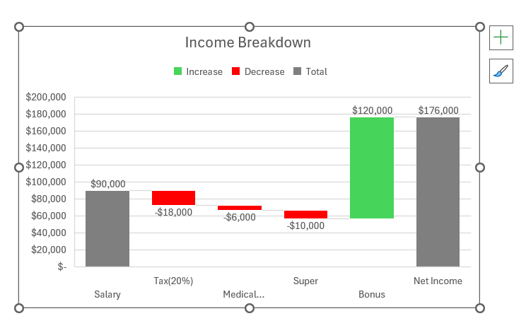
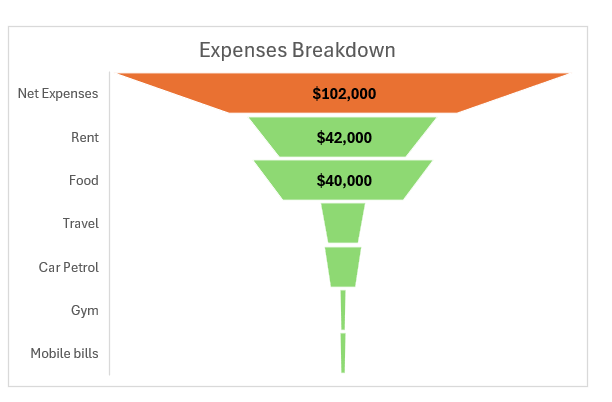
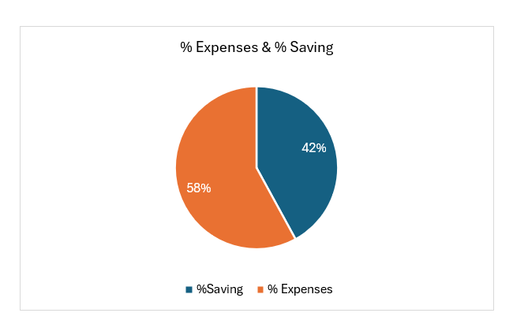

---
### **Budget Tracking Portfolio**

---

A professional Excel-based tool for tracking income, expenses, and savings, designed to empower users with clear financial insights and data visualization.

---
### 📊**Features**

---

- **Income Breakdown**: Track salary, taxes, superannuation, bonuses, and net income.
- **Expense Categorization**: Detailed tracking of rent, food, travel, car petrol, gym, and mobile bills.
- **Savings Analysis**: Visualize savings vs. expenses with dynamic charts.
- **Yearly Overview**: Summarize financial health with annual income and net expense totals.
- **Interactive Dashboard**: User-friendly interface for real-time budget adjustments.
 
---
 ### **📂 Sample Data Breakdown**
 
---

### Annual Income
| Component       | Amount       |
|-----------------|--------------|
| Salary          | $200,000     |
| Tax (20%)       | -$40,000     |
| Super           | -$18,000     |
| Bonus           | -$6,000      |
| **Net Income**  | **$136,000** |
##
### Expenses (58% of Budget)
| Category        | Amount       |
|-----------------|--------------|
| Rent            | $42,000      |
| Food            | $40,000      |
| Travel          | $12,000      |
| Car Petrol      | $5,000       |
| Gym             | $2,000       |
| Mobile Bills    | $1,000       |
| **Total**       | **$102,000** |
##
 **Savings (42% of Budget)**
##
**Annual Savings:** $57,120 (42% of net income)

---
### 🚀 Getting Started
---

1. **Download the Tool**: Clone this repository or download the `Budget_Tracker.xlsx` file.
2. **Open in Excel/Sheets**: Use Microsoft Excel or Google Sheets for full functionality.
3. **Input Your Data**: Replace sample values with your income and expense details.
4. **Analyze**: Utilize charts and tables to monitor your financial progress.

---

### 📸 Screenshots
---

 
- **Income Breakdown:**
##
 
 ##
- **Expense Breakdown:**
##
 
 ##
 - **%Saving And %Expenses Pie Chart:**
##

##
- **%Saving And %Expenses Doughnut:**
##

*

---

### 🤝 Contributing
---
Contributions are welcome!  
1. Fork the repository.  
2. Create a branch: `git checkout -b feature/new-enhancement`.  
3. Commit changes: `git commit -m 'Add feature'`.  
4. Push to the branch: `git push origin feature/new-enhancement`.  
5. Submit a **Pull Request**.

---

### 📜 License
---

This project is licensed under the MIT License. 

---

*Optimize your financial planning with clarity and precision. 🌟*
